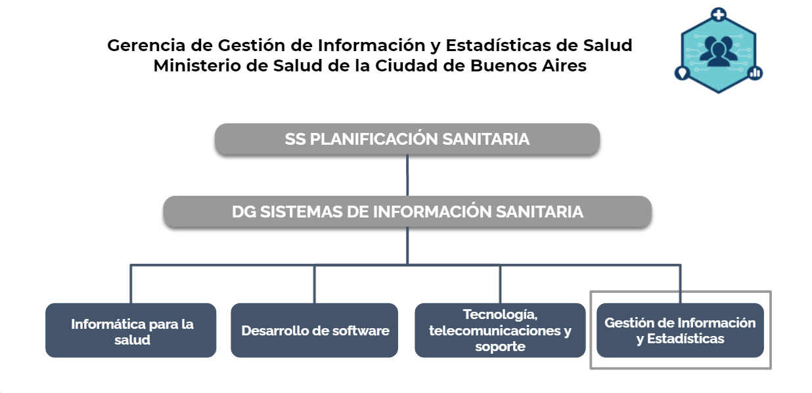
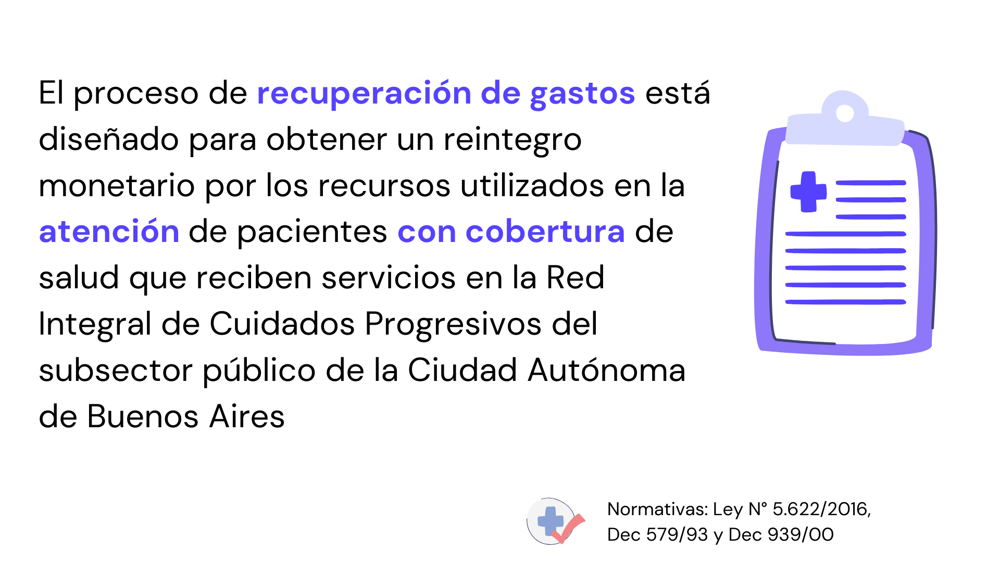
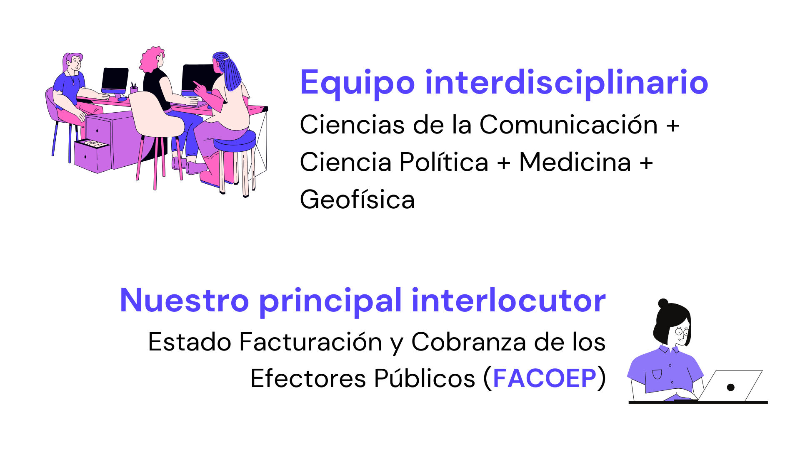
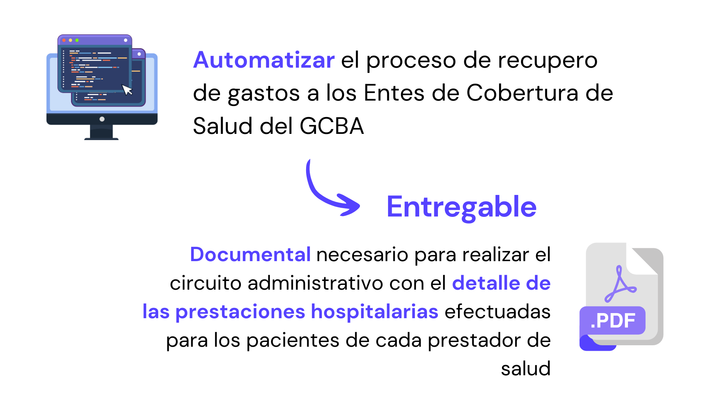
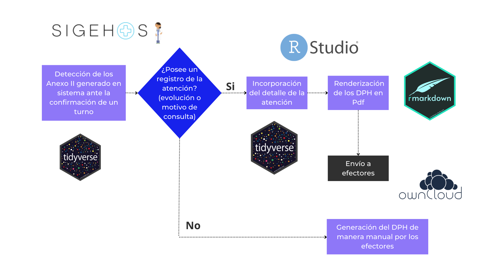

<!-- https://arm.rbind.io/slides/xaringan.html#1 -->
<!-- https://spcanelon.github.io/xaringan-rladies-xalapa/diapositivas/introduccion-xaringan.html#54 -->

# Quienes somos

<!--  -->

---

class: chapter-slide

# Contexto y motivación

---

# Recupero de gastos

<!--  -->

---
# Nuestro equipo

<!--  -->

---

# Objetivos del Proyecto

<!--  -->

---

# El circuito administrativo

<!--  -->

---

class: chapter-slide

# Resolución técnica

---

# Herramientas

<!--  -->
---

# Circuito

<!--  -->

---

class: chapter-slide

# Resultados

---

## ¿Cómo impactó en la facturación?

<!--  -->

---

## ¿Cómo impactó en la facturación?

<!--  -->

---

## Muchas gracias!

 
 
 

**María Cristina Nanton** 
m.nanton@buenosaires.gob.ar  
**Manuel Rodríguez Tablado** 
mrodrigueztablado@buenosaires.gob.ar  
**Ariana Bardauil** 
abardauil@buenosaires.gob.ar  

